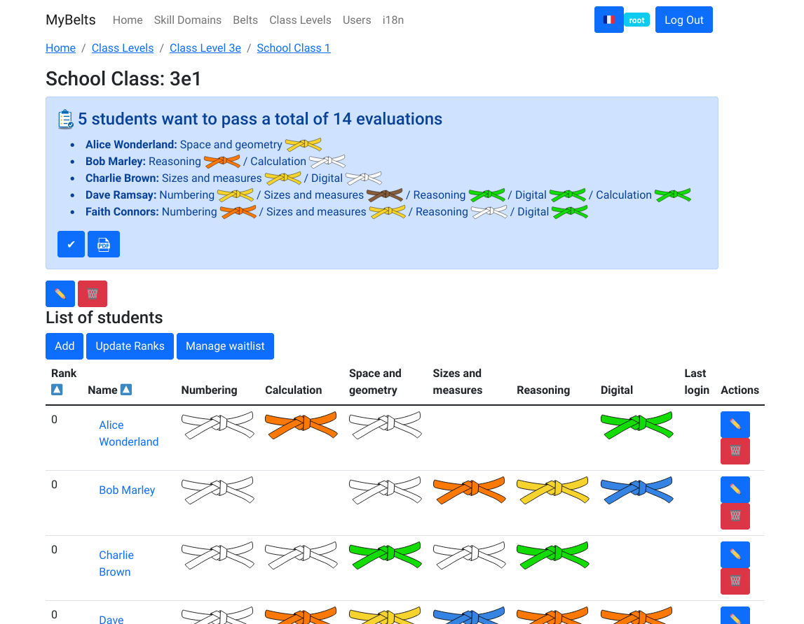

# MyBelts

The French education system is currently working on evaluating students by skills instead of grades (pages in French).
It means that teachers have to evaluate their students individually on specific skills within the subject they teach.
For instance, a math teacher will have to evaluate the level of proficiency of each student with performing calculation, handling sizes and measures, using digital tools, following a rigorous reasoning, and so on.

To adapt the method to students of various levels, evaluations should be customized for each student, depending on how far they have progressed with a skill.
However, tracking this, printing the evaluations and distributing them can take a significant amount of time.

This is why I have created MyBelts, a web application that lets teachers manage their class for this purpose.
They can register students for the next evaluation in any given skill, and students can also register themselves. When a teacher wants to make their student take an evaluation, they can click on a single button that generates a single PDF with the appropriate evaluation sheets for each student, and their names prefilled. Once the evaluation is done, they can easily check in which students passed and which did not. This way, the application will know what evaluation they need to pass next time.



# Installing

## Python

- install Python 3.9 or later (`sudo apt install python3`)
- create a virtual environment (`python3 -m venv env`)
- activate the virtual environment (`source env/bin/activate`)
- install the Python packages (`pip install -r requirements.txt`)

## npm

- install Node and npm
- install the npm packages (`npm install`)

## PostgreSQL

- install PostgreSQL (`sudo apt install postgresql`)
- create a database `mybelts` with a user `mybelts` using password `mybelts`
- activate the virtual environment (`source env/bin/activate`)
- create tables in the database (`alembic upgrade head`)
- populate the tables (`./test-api`)

## Other Dependencies

`sudo apt install inkscape pdftk texlive-extra-utils texlive-latex-recommended`


# Running

- start the system services (`sudo systemctl start postgresql`)
- activate the Python virtual environment (`source env/bin/activate`)
- start the back-end (`FLASK_DEBUG=1 flask run`)
- start the front (`npm start`)
- login as `root` with password `root`

# Testing

```
flake8 .
mypy .
./test-api
npx eslint src/*tsx
```

# Developing

## Updating TypeScript Models for the API

Assuming the API is listening locally on port 80, just run `./refresh-api-schema`.
